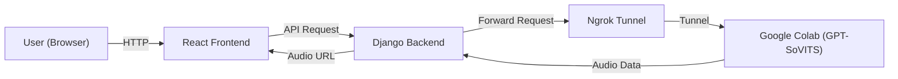

# GPT-SoVITS Web Inference (Colab Backend)

[Read this document in Chinese (中文版)](README.zh.md)

A web-based voice synthesis application built on **GPT-SoVITS**. It features a frontend-backend separated architecture that leverages Google Colab's free GPU resources for inference, uses Django backend for request forwarding and audio management, and provides a modern user interface with React.

## 🏗 Architecture

Since GPT-SoVITS requires significant GPU computing power, this project is designed as follows:

1.  **Frontend (React)**: User inputs text and selects parameters.
2.  **Backend (Django)**: Receives frontend requests, manages API keys and audio file storage.
3.  **Inference Engine (Google Colab)**: Runs the GPT-SoVITS model and exposes the API to the public network via Ngrok.



## 🚀 Quick Start

### 1. Colab Setup (Inference Service)

1.  Upload `Colab_InferenceAPI.ipynb` to your Google Drive or open it directly in Colab.
2.  Follow the Notebook instructions to run code blocks:
    *   Install dependencies.
    *   Download models.
    *   Start API service (will display an Ngrok URL, e.g., `https://xxxx.ngrok-free.app`).
3.  **Copy** this Ngrok URL.

### 2. Backend Setup (Django)

Make sure you have Python 3.10+ installed.

```bash
cd tts_project

# 1. Install dependencies
pip install django requests python-dotenv

# 2. Configure environment variables
# Copy .env.example (if available) or create .env file directly
# Edit .env file and fill in the Ngrok URL generated by Colab
# COLAB_API_BASE=https://xxxx-xxxx.ngrok-free.app

# 3. Run database migrations
python manage.py migrate

# 4. Start backend service
python manage.py runserver
```
Backend runs on `http://127.0.0.1:8000` by default.

### 3. Frontend Setup (React + Vite)

Make sure you have Node.js installed (LTS version recommended).

```bash
cd frontend

# 1. Install dependencies
npm install

# 2. Start development server
npm run dev
```
Frontend runs on `http://localhost:5173` by default.
*Note: `--host` is configured to support LAN access. You can access and test across devices using the IP address.*

## 📝 Configuration

### `.env` File (located at `tts_project/.env`)

This is the key to connecting your local backend with Colab. Every time Colab restarts, the Ngrok URL changes, and you need to update this file.

```ini
# Don't include trailing slash /
COLAB_API_BASE=https://your-ngrok-url.ngrok-free.app
SECRET_KEY=django-insecure-change-me-in-production
DEBUG=True
```

> **Note:** Debug mode and insecure key are enabled for demonstration purposes. For production, set `DEBUG=False` and use a strong `SECRET_KEY`.

### API Parameter Adjustment (`tts_project/api/views.py`)

If you change the reference audio, you need to modify the following parameters in `views.py` for better results:

*   `ref_audio_path`: Absolute path to the reference audio in Colab.
*   `prompt_text`: Text content corresponding to the reference audio.
*   `prompt_lang`: Language of the reference audio.

**Latest Optimizations:**
*   Added `ref_audio_path` and `prompt_text` parameters to the `generate_audio` interface, resolving the "ref_audio_path is required" error
*   Optimized `text_lang` and `prompt_lang` parameter settings to ensure the model correctly utilizes reference audio for cloning
*   Configuration has been separated from code to `.env` file, improving maintainability

## 🛠 FAQ

**Q: Error "ref_audio_path is required"?**
A: This issue has been fixed in the latest version. Now `ref_audio_path` and `prompt_text` parameters are added to the `generate_audio` interface, ensuring the model correctly loads reference audio.

**Q: Frontend shows "Network Error" or backend 500 error?**
A: 
1. Check if the Colab/Ngrok URL has expired (Colab runtime disconnected or Ngrok tunnel closed).
2. Check if the address in the `.env` file is up to date.
3. Make sure the API service in Colab is running (code block is in spinning state).

**Q: How to access from mobile?**
A: Make sure your phone and computer are on the same Wi-Fi network. Check the Network address output from `npm run dev` (e.g., `http://192.168.1.x:5173`) and enter that address in your phone's browser.

## 📄 License

MIT
