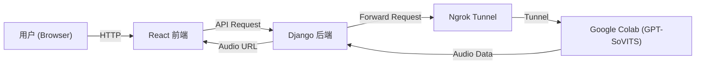

[Read this document in English (英文版)](README.md)

# GPT-SoVITS Web Inference (Colab Backend)

这是一个基于 **GPT-SoVITS** 的语音合成 Web 应用。它采用前后端分离架构,利用 Google Colab 的免费 GPU 资源进行推理,通过 Django 后端进行请求转发和音频管理,前端使用 React 提供现代化的用户界面。

## 🏗 架构说明

由于 GPT-SoVITS 需要较强的 GPU 算力,本项目设计为:

1.  **Frontend (React)**: 用户输入文本,选择参数。
2.  **Backend (Django)**: 接收前端请求,管理 API 密钥和音频文件存储。
3.  **Inference Engine (Google Colab)**: 运行 GPT-SoVITS 模型,通过 Ngrok 将 API 暴露给公网。



## 🚀 快速开始

### 1. Colab 端设置 (推理服务)

1.  上传 `Colab_InferenceAPI.ipynb` 到你的 Google Drive 或直接在 Colab 打开。
2.  按照 Notebook 指引运行代码块:
    *   安装依赖。
    *   下载模型。
    *   启动 API 服务 (会显示一个 Ngrok URL,例如 `https://xxxx.ngrok-free.app`)。
3.  **复制** 这个 Ngrok URL。

### 2. Backend 设置 (Django)

确保你已安装 Python 3.10+。

```bash
cd tts_project

# 1. 安装依赖
pip install django requests python-dotenv

# 2. 配置环境变量
# 复制 .env.example (如果有) 或直接创建 .env 文件
# 编辑 .env 文件,填入 Colab 生成的 Ngrok 地址
# COLAB_API_BASE=https://xxxx-xxxx.ngrok-free.app

# 3. 运行数据库迁移
python manage.py migrate

# 4. 启动后端服务
python manage.py runserver
```
后端默认运行在 `http://127.0.0.1:8000`。

### 3. Frontend 设置 (React + Vite)

确保你已安装 Node.js (推荐 LTS 版本)。

```bash
cd frontend

# 1. 安装依赖
npm install

# 2. 启动开发服务器
npm run dev
```
前端默认运行在 `http://localhost:5173`。
*注:已配置 `--host`,支持局域网访问。可通过 IP 地址进行跨设备访问和测试。*

## 📝 配置说明

### `.env` 文件 (位于 `tts_project/.env`)

这是连接本地后端和 Colab 的关键。每次 Colab 重启,Ngrok 地址都会变化,你需要更新此文件。

```ini
# 不要带最后的斜杠 /
COLAB_API_BASE=https://your-ngrok-url.ngrok-free.app
SECRET_KEY=django-insecure-change-me-in-production
DEBUG=True
```

> **注意:** 调试模式和不安全的密钥仅用于演示目的。生产环境中请设置 `DEBUG=False` 并使用强 `SECRET_KEY`。

### API 参数调整 (`tts_project/api/views.py`)

如果你更换了参考音频,需要在 `views.py` 中修改以下参数以获得更好的效果:

*   `ref_audio_path`: Colab 中参考音频的绝对路径。
*   `prompt_text`: 参考音频对应的文本内容。
*   `prompt_lang`: 参考音频的语言。

**最新优化:**
*   已添加 `ref_audio_path` 和 `prompt_text` 参数到 `generate_audio` 接口,解决 "ref_audio_path is required" 错误
*   优化了 `text_lang` 和 `prompt_lang` 参数设置,确保模型正确利用参考音频进行克隆
*   配置已从代码中分离到 `.env` 文件,提升可维护性

## 🛠 常见问题

**Q: 报错 "ref_audio_path is required"?**
A: 此问题已在最新版本中修复。现在 `ref_audio_path` 和 `prompt_text` 参数已添加到 `generate_audio` 接口中,确保模型正确加载参考音频。

**Q: 前端显示 "Network Error" 或后端 500 错误?**
A: 
1. 检查 Colab 也就是 Ngrok 地址是否过期(Colab 运行时断开或 Ngrok 隧道关闭)。
2. 检查 `.env` 文件中的地址是否是最新的。
3. 确保 Colab 中的 API 服务正在运行(代码块处于转圈状态)。

**Q: 如何在手机上访问?**
A: 确保手机和电脑在同一 Wi-Fi 下。查看 `npm run dev` 输出的 Network 地址(如 `http://192.168.1.x:5173`),在手机浏览器输入该地址即可。

## 📄 License

MIT
